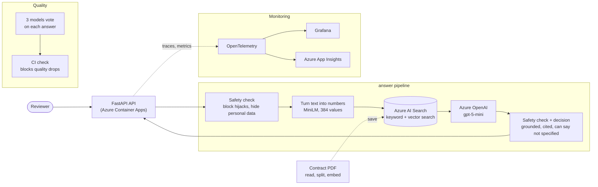
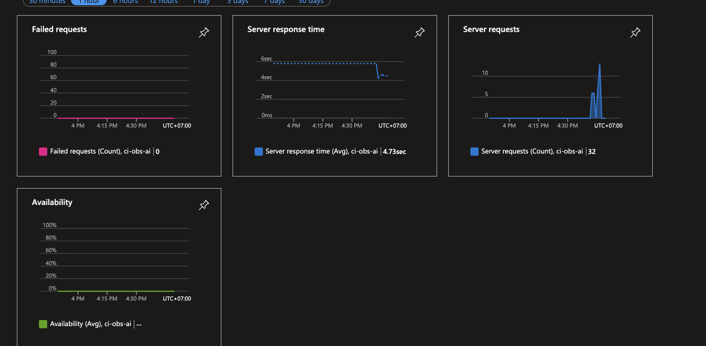
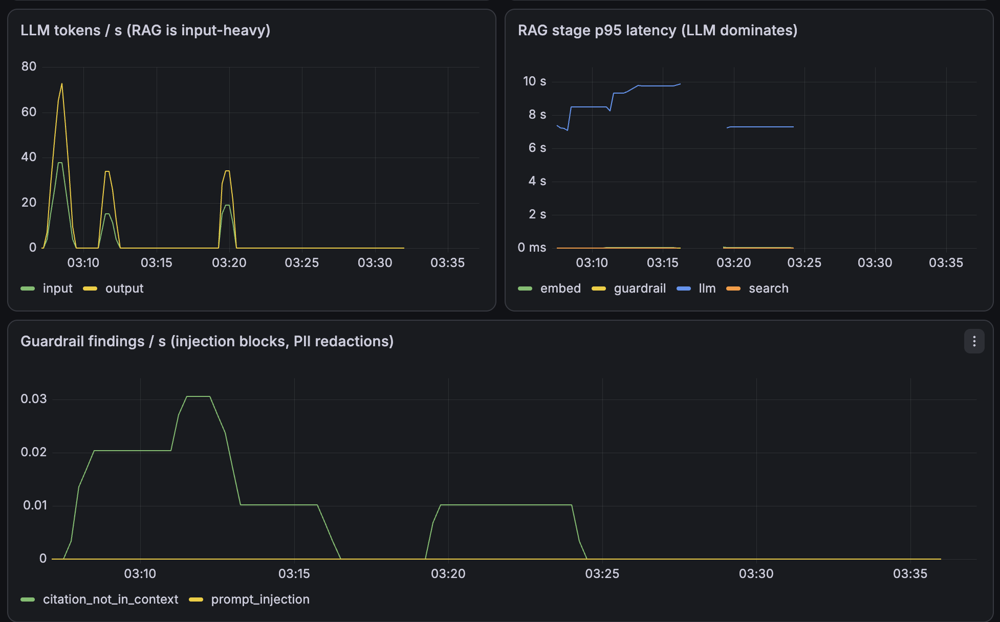

<div align="center">

# Contract Intelligence

A system that answers questions about legal contracts. It measures how often it makes things up, fails its own build when that number gets worse, and runs with monitoring on Azure.

[](https://www.python.org/)
[](https://azure.microsoft.com/products/ai-services/openai-service)
[](https://azure.microsoft.com/products/ai-services/ai-search)
[](#engineering-notes)
[](#the-eval-gate)

</div>

Ask a set of contracts a plain question like "What law governs this agreement?" or "Is there a liability cap?", and you get back an answer that comes straight from the contract text, points at the exact clause it used, and says "not specified" when the contract does not cover it, instead of guessing. This is a RAG system (retrieval augmented generation: it looks up the relevant text first, then asks the model to answer using only that text).

Every answer runs through a score for how often the model makes things up. We measure that score, we can replay it exactly, and we block any code change that makes it worse. The system runs on Azure OpenAI and Azure AI Search, deploys to Azure Container Apps, signs in without any password (using an Azure identity), and reports what it is doing through OpenTelemetry, either to a local dashboard or to Azure Application Insights.

## Demo

<video src="https://raw.githubusercontent.com/FRAMEEE17/contract-intel/main/assets/demo-azure.mp4" controls muted width="100%"></video>

Watch or download: [assets/demo-azure.mp4](assets/demo-azure.mp4)

## Contents

- [Why we built it](#why-we-built-it)
- [Highlights](#highlights)
- [Architecture](#architecture)
- [Results](#results)
- [The eval gate](#the-eval-gate)
- [Observability](#observability)
- [Tech stack](#tech-stack)
- [Quickstart](#quickstart)
- [Project layout](#project-layout)
- [Engineering notes](#engineering-notes)

## Why we built it

Teams that work with contracts, whether that is M&A due diligence, an internal legal team, or procurement, spend hours reading hundreds of pages to answer a handful of questions. The obvious idea is to point an AI model at the documents. The problem is that a plain language model makes things up. Ask whether a contract caps liability and, if the contract does not mention it, the model will confidently invent an answer. In legal work that is worse than "I don't know", because someone will act on it.

So the design comes down to two rules. First, the answer has to come from the actual contract text, not from a summary the model wrote for itself. Second, the model has to say when it does not know, because "not specified" is often the answer a reviewer actually wants: a contract that is silent on something usually means a clause is missing. From there, the rate of made up answers becomes a number we measure and check on every code change, instead of a claim we hope is true.

## Highlights

| | |
|---|---|
| **We measured hallucination** | We cut the rate of made up answers from 25.3% to 15.3%, a 10 point drop. The statistics say this is a real improvement and not luck (95% confidence interval from -16 to -4). Answer correctness held steady around 78%. Running `make eval` replays that exact number offline in about a second. |
| **The score blocks bad merges** | The score runs automatically on GitHub for every code change. If quality drops, the build turns red and the change cannot be merged. |
| **Built on Azure** | Azure OpenAI (gpt-5-mini) writes the answer. Azure AI Search finds the right clauses with hybrid search: keyword matching (BM25) plus meaning based vector search. Azure Document Intelligence reads scanned PDFs. |
| **No passwords in the code** | The app signs in to Azure with a managed identity, which is an Azure login that has no password, so there are no secret keys in the code or the settings. Key Vault holds the one secret that is left. |
| **Safety checks** | Before anything reaches the model or the logs, the pipeline blocks attempts to hijack the prompt and hides personal data (email, phone, and so on), both on the way in and on the way out. |
| **You can see what it does** | OpenTelemetry sends metrics and traces to a local Grafana dashboard, or to Azure Application Insights by changing one setting. You get request rate, errors, latency, cost per answer, and a breakdown of what the model decided. |
| **One command to deploy** | Terraform sets up the container registry and Azure Container Apps. The API and the Streamlit web UI ship as small Docker images with the search model already inside, so nothing has to download on the first request. |
| **Tests you can rerun** | 134 tests, all offline and repeatable, using stand in fakes for logic and recorded model outputs for the evaluation. One command: `make ci`. |

## Architecture

How do you keep the core logic from getting tied to one cloud vendor? The code is split so that the main logic does not depend on any specific tool. The `answer_question` step only talks to plain interfaces, and one file wires in the real tools (the model, the search engine, the safety check). That is why we can build against a free local model and switch to Azure by changing a config value.



We chose the storage to fit how the data is actually queried. The most common request is: given a question turned into numbers and an optional document filter, find the closest few chunks of text and mix in a keyword match. A search and vector store is built for exactly that. It keeps a keyword index (BM25) and a nearest match index for the number vectors (HNSW), and it can filter by document at the same time.

## Results

We reduced the rate of made up answers from 25.3% to 15.3% on 150 questions from CUAD, a public legal benchmark. That is a 10 point drop, and the statistics show it is a real gain and not chance (95% confidence interval from -16 to -4). Answer correctness stayed around 78%. Three separate models act as judges and grade each answer against the source text, and the whole run replays offline from saved results with no model calls.

| Measure | Before | After |
|---|:---:|:---:|
| Made up answers (lower is better) | 25.3% | **15.3%** |
| Answer correctness | 77% | **79%** |
| Broken or unreadable answers | 1.3% | **0.0%** |

The improvement came from a better prompt plus an upgrade to the gpt-5-mini model. We measured it with a standard statistical test (a paired bootstrap over 10,000 samples) on the same questions and the same judges. Because the same judges grade both versions on the same data, any consistent bias in the judges cancels out when we compare the two, which makes the difference more reliable than either raw number on its own.

## The eval gate

How do you stop a quality drop from ever reaching users? You put the check in the build. On every pull request, GitHub Actions replays the saved evaluation and stops the merge if the numbers get worse.

The replay gives exactly the same result every time and never calls the network. We proved this by making the network throw an error on purpose and watching the check still pass. Because the replay is exact, the check can demand an exact match: the only thing that can move the number is a genuine change to the scoring, the questions, or a judge.

The check looks at a few numbers at once: a cap on made up answers, a minimum on correctness, and a cap on how often the model wrongly refuses to answer. That combination means you cannot cheat the check by simply refusing to answer everything. We also store a fingerprint (a SHA-256 hash) of the answer key, so quietly editing the answers will fail the check.

```bash
make ci        # 134 tests plus the quality check, fully offline
make eval      # replay the headline number in about a second
```

## Observability

How do you know what the system is doing once it is live? OpenTelemetry is added at the outer edge of the code, so the core files carry no tracing code, and the tracing does nothing when tests run. Changing one setting (a connection string) switches the whole thing from the local Grafana dashboard to Azure Application Insights, with no code change.

Live on Azure Application Insights. The real gpt-5-mini response time shows up on Azure itself, averaging 4.73 seconds, with zero failed requests.



The local Grafana dashboard. The latency of each step shows the model itself takes almost all the time, while turning text into numbers, searching, and the safety check are close to zero. It also shows live token cost and how often the safety check fires.



We track the basics per route (how many requests, how many errors, how long they take) with target lines drawn in (95th percentile under 3 seconds, errors under 1%), a trace for each step of the pipeline, the number of tokens in and out for cost, and a live count of what the model decided, which tells us in production whether the "only answer when sure" behaviour still holds.

## Tech stack

| Layer | Technology |
|---|---|
| Model | Azure OpenAI gpt-5-mini. The adapter handles the special request format these newer models need. |
| Search | Azure AI Search. Hybrid keyword (BM25) and vector search (HNSW), with the two rankings merged and filtering by document. |
| Text to numbers | sentence-transformers all-MiniLM-L6-v2, 384 values per chunk, compared by cosine similarity. |
| Reading PDFs | PyMuPDF for normal PDFs, Azure Document Intelligence for scanned pages. |
| API and UI | FastAPI and Streamlit. |
| Evaluation | Three models vote as judges (Groq), a bootstrap statistical test, and saved results for exact replay. |
| Safety | Blocks prompt hijacking and hides personal data. Azure Content Safety can drop in behind the same interface. |
| Monitoring | OpenTelemetry to Prometheus, Tempo and Grafana, or to Azure Application Insights. |
| Infra and CI | Terraform, Azure Container Apps, managed identity and Key Vault, GitHub Actions. |
| Testing | pytest (134 tests), with fakes and saved results so runs are repeatable. |

## Quickstart

Run the full stack locally with Docker, using [Colima](https://github.com/abiosoft/colima) or Docker Desktop:

```bash
git clone https://github.com/FRAMEEE17/contract-intel.git
cd contract-intel

cp .env.example .env          # add your Azure OpenAI and AI Search settings
docker compose up -d --build  # starts the API and the Streamlit UI

open http://localhost:8501    # the web UI
open http://localhost:8000/docs   # the API docs
```

Ask a question against the sample contract that ships with the repo, or upload your own PDF to the library.

Run the tests and the quality check:

```bash
python -m venv .venv && source .venv/bin/activate
pip install torch --index-url https://download.pytorch.org/whl/cpu
pip install -r requirements.txt
make ci      # 134 tests plus the quality check
```

Deploy to Azure with Terraform:

```bash
cd infra
terraform init
terraform apply     # container registry, Container Apps, identity roles
```

## Project layout

```
contract-intel/
├── app/
│   ├── domain/            # the plain interfaces the core depends on
│   ├── application/       # answer_question, summarize, the main steps
│   ├── adapters/          # model, search, embeddings, documents, safety checks
│   ├── observability.py   # OpenTelemetry setup (local and App Insights)
│   └── config.py          # the one file that wires in local or Azure
├── api/                   # FastAPI service
├── frontend/              # Streamlit UI
├── evals/                 # the score, the judges, the gate, saved results
├── infra/                 # Terraform (registry, Container Apps, identity, Key Vault)
├── observability/         # Prometheus, Tempo, Grafana setup
├── .github/workflows/     # the quality gate on pull requests, plus deploy
└── tests/                 # 134 tests, unit and integration
```

## Engineering notes

Swappable tools. The main logic never imports a vendor library directly. One file wires everything together, so bringing three Azure services online was a quick check each time, not a rewrite.

How we score it. A made up answer counts as either a wrong answer or an invented one when the contract is silent, graded against the source. That is harder to cheat than an easier score that only checks whether the answer sounds supported, so we report those two things separately.

Support for newer models. gpt-5-mini needs a different request field (`max_completion_tokens` instead of `max_tokens`) and does not accept custom sampling settings. One flag in the adapter detects this and handles it, and the local model path is unchanged.

Safe re-uploads. Each chunk of text gets its ID from its own content, so uploading the same file twice does not create duplicates.

Repeatable tests. No test calls a real model or the network. Fakes cover the logic and saved outputs cover the evaluation, so every run gives the same result.

<div align="center">

Built by [FRAMEEE17](https://github.com/FRAMEEE17)

</div>
